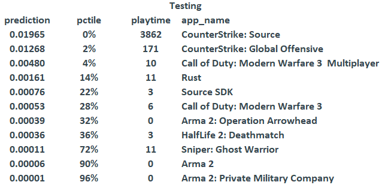

## Examen final Métodos Analíticos. 

### Maestría en Ciencia de Datos ITAM {.tabset .tabset-fade .tabset-pills}

```{r setup, include=FALSE}
knitr::opts_chunk$set(echo = TRUE)
library(tidyverse)
library(tidyverse)
library(DT)
library(kableExtra)
library(readxl)
```

# Introducción

Los sistemas de recomendación funcionan como filtros que clasifican la información que recibirá el usuario en una plataforma. Tienen como objetivo mejorar la experiencia del usuario  a través de sugerencias personalizadas basadas en la retroalimentación. 

Los sistemas de recomendación se clasifican de la siguiente manera. 

 1. Basados en contenido: Tomando en cuenta algunos datos del historial del usuario intentan  predecir qué busca el usuario y que sugerencias similares puede  mostrar. 
 
 2. Filtrado colaborativo: Recomienda nuevos productos según las interacciones de los usuarios y/o las calificaciones de varios productos. La recomendación se basa en usuarios que han hecho valoraciones semejantes o bien, encontrando la similitud entre artículos dada por el gusto de los usuarios. El filtrado colaborativo se alimenta de dos tipos de datos.
 
    * Retroalimentación explícita: Se obtiene de evaluaciones claras dadas por los usuarios de los productos que les han interesado. Por ejemplo, los datos de clasificación de estrellas recopilados de las clasificaciones de películas. Por ejemplo, Netflix mucho tiempo fue así: $1-5$ estrellas. En concreto, la retroalimentación la da el usuario. 

    * Retroalimentación implícita: Se obtiene de la actividad de los usuarios. Por ejemplo, historial de navegación, click en la descripción de un producto, el modo de búsqueda e incluso las acciones del mouse.
    
Hay extensa literatura que se ocupa del filtrado colaborativo con retroalimentación explícita. La retroalimentación explícita enfrenta ciertos problemas, por ejemplo, procesar los comentarios explícitos en ocasiones es difícil porque  la información no siempre está disponible. Además, los usuarios pueden ser renuentes a calificar productos, incluso por las limitaciones del sistema que no pueden recopilar datos de comentarios explícitos. En un modelo de filtrado colaborativo con retroalimentación implícita,una vez que el usuario aprueba que se recolecte información, no se necesitan datos adicionales del lado del cliente.

Otra diferencia es que en retroalimentación implícita no hay retroalimentación negativa, porque solamente se observa el comportamiento del usuario. Únicamente se observan los artículos que consume y no aquellos que le "desagradan". En retroalimentación explícita, los menos agradables tienen un rating menor. 

En retroalimentación explícita el valor del rating indica preferencia, en implícita obtenemos confianza. Los valores de horas de videojuego por usuario nos describe la frecuencia de las acciones realizadas. En este caso, este dato nos otorga confianza en cada observación. Es muy probable que la recurrencia de un evento (horas jugadas) refleje la opinión del usuario.

Este trabajo desarrolla un modelo de filtrado colaborativo con retroalimentación implícita, el cuál está inspirado en el artículo de [Collaborative Filtering for Implicit Feedback Datasets](http://yifanhu.net/PUB/cf.pdf) en el que desarrollan un algoritmo de sistema de recomendación de programas de televisión para el usuario final.

El objetivo de este trabajo es realizar recomendaciones sobre videojuegos, de acuerdo con su experiencia en la plataforma. La recomendación toma como insumo el número de horas que los usuarios dedican a jugar algún videojuego en particular. 

La estructura del trabajo es la siguiente: En la primera parte se hace una descripción de la base de datos utilizada y el procesamiento que se llevó a cabo para realizar un Split de entrenamiento y validación; la sección de Metodología explica el modelo de optimización para minimizar la función de pérdida por medio del algoritmo "Alternating Leas Suares (ALS), tomando en cuenta los ajustes de confianza"; La evaluación explica la manera en que se genera un rango para obtener la recomendación; La sección de resultados muestra qué parámetros fueron otorgaron mejores resultados; por último, las conclusiones ofrecen recomendaciones sobre los resultados del modelo y aspectos a considerar del análisis.


# Base de datos

Los datos utilizados se obtuvieron de la base *Condensing Steam: Distilling the Diversity of Gamer Behavior*, que agrupa información histórica de 108.7 millones de usuarios recolectados en 2014 de la plataforma de videojuegos Steam, con 716 millones de juegos y hasta 1.1 millones de años en horas jugadas.

La base original está compuesta de 11 tablas de datos que contienen información diversa sobre los usuarios y sus atributos (id, juegos jugados, horas jugadas, información geográfica, información sobre sus "amigos", entre otros.), así como de los juegos y sus características (género, desarrollador, editor, etc.). Tiene un peso de 17.5GB comprimida, y 160GB al descomprimirse, y está en formato *.sql*. Para utilizarla, fue necesario restaurarla utilizando el sistema manejador de bases de datos *MariaDB*, el cual opera basado en *MySQL*.

Para el presente proyecto, se utilizó un subconjunto de *Condensing Steam* tomando de manera aleatoria 800 mil usuarios contenidos en la base. Se utilizan las tablas `Games_1` y `Games_2`, que contienen información sobre el id del jugador, id del juego o app, y el número de minutos jugados.

El diccionario que contiene la relación entre el id del videojuego y su nombre fue obtenida de https://github.com/dgibbs64/SteamCMD-AppID-List, y completada manualmente con ayuda de la herramienta web https://steamdb.info/.

Se identificó que existen algunos videojuegos con el mismo nombre, pero con diferente id, por lo cual se reindexó dicho catálogo, utilizando nombres de videojuegos únicos, y sumando el número de minutos de todos los jugadores, en caso de que tuvieran tiempo de juego en un app que tuviera dos ids.

El conjunto de datos resultante está compuesto de 7.2 millones de observaciones y 3 variables que son las que se utilizarán para construir el sistema de recomendación implícito:

 - `steamid`: el identificador del usuario de la plataforma
 - `app_name`: nombre del videojuego
 - `playtime_forever`: minutos totales que el usuario ha utilizado el videojuego.
 
Exploramos algunos datos de la tabla:

```{r, echo = FALSE}
cat_def <- read_rds('cache/cat_apps_def.rds')
cat_limpio <- read_rds('cache/cat_apps_limpio.rds')
dta_clean <- read_rds('cache/data_clean.rds')
```


```{r}
head(dta_clean)
```

Del total de los usuarios recolectados, se eliminaron aquellos que estaban registrados en la plataforma y tenían al menos algún videojuego registrado pero sin haberlo jugado. En ese sentido, se tienen 732,759 usuarios diferentes que interactúan con 4,133 videojuegos.

```{r, echo=FALSE, eval=FALSE}
dim(dta_clean)
length(unique(dta_clean$steamid))
length(unique(dta_clean$app_name))
```

Respecto al número de minutos jugadas `playtime_forever` se calculan algunos percentiles:

```{r}
summary(dta_clean$playtime_forever)
```

### Split en entrenamiento y validación

Los datos se dividen en un conjunto de entrenamiento que nos servirá para construir el modelo y otro de validación con el que evaluaremos las recomendaciones sugeridas.

El set de validación se construye tomando los registros que pertenecen a la intersección de ambos conjuntos definidos anteriormente. Al ser la intersección, el porcentaje de la base conservado es aprox $.5 *.5 = .25 = 25\%$.

El set de entrenamiento, entonces, se compone por todos los registros que NO pertenecen al set de validación.

Para ello, se extraen de manera aleatoria 50% de los usuarios de la plataforma (`steamid`), y después se extraen de manera aleatoria el 50% de los videojuegos (`app_name`). El set de validación se construye tomando los registros que pertenecen a la intersección de ambos conjuntos definidos anteriormente. Al ser la intersección, el porcentaje de la base conservado es aprox $.5 *.5 = .25 = 25\%$, equivalente a 1.78 millones de observaciones. El set de entrenamiento, entonces, se compone por todos los registros restantes que no pertenecen al set de validación y equivalen a 5.42 millones de observaciones.

```{r, echo=FALSE}
dta_train <- read_rds('cache/dta_train.rds')
dta_validation <- read_rds('cache/dta_validation.rds')
```


```{r, echo = FALSE, eval=FALSE}
dim(dta_train)
dim(dta_validation)
```

Despúes de la separación, el conjunto de entrenamiento contiene 652,117 usuarios distintos y 4,115 videojuegos, mientras que el de validación tiene 270,827 usuarios y 2,038 videojuegos.

```{r, echo = FALSE}
length(unique(dta_train$steamid))
length(unique(dta_train$app_name))
length(unique(dta_validation$steamid))
length(unique(dta_validation$app_name))
```


# Metodología

Los sistemas de recomendación buscan resolver el problema de "predecir la respuesta de personas a estímulos a los que no han sido expuestos, basados en respuesta a otros estímulos de esta y quizá otras personas similares". 

El más común es el explícito, donde el usuario otorga una calificación al producto (típicamente en una escala del 1 a 5 estrellas), para lo cual se cuentan con modelos de recomendación y métricas de evaluación (RMSE) bien definidas a partir de dichas calificaciones explícitas.

Los sistemas de recomendación implícitos se refieren a contextos donde no se tiene una calificación/evaluación del producto explícitamente definida por el usuario, pero se tienen variables de acciones del usuario que reflejan la preferencia o popularidad del producto y que, en muchos casos, resultan más informativos que la calificación directa otorgoda por el usuario.

Nuestro sistema de recomendación se construye utilizando las horas jugadas por un usuario para cada videojuego.

### Modelo 

Para este trabajo consideramos el índice $u,v$ para distinguir usuarios; los artículos están determinados por los subíndices $i,j$. De tal forma que podemos relacionar a los usuarios y los artículos mediante la relación $r_{u,i}$.  Esta relación representa la frecuencia de acciones sobre un artículo, por ejemplo, el número de compras en un sitio web, el número de veces que oprimimos la tecla "favoritos", clicks que damos a un producto en especial o el tiempo utilizamos para ver videos o escuchar música. La notación $r_{u,i}$ es una medida implícita para el usuario $u$ y el artículo $i$. En el contexto de recomendación implícita, $r_{u,i}$ son las observaciones que se tienen. Hay que notar que en la recomendación explícita estos valores serían llamados los "ratings" otorgados a los artículos. Aquí le llamamos observaciones.


Para poner en contexto, $r_{u,i}$ inidca el número de ocasiones que el individuo $u$ adquiere el artículo $i$. O bien el tiempo que $u$ navega en el sitio web de $i$.En nuestro ejercicio, $r_{u,i}$ indica el tiempo que un individuo dedica a jugar un videojuego en específico.

Para nuestro modelo, consideramos la variable binaria $p_{u,i}$ que nos indica la preferencia del usuario $u$ por un artículo $i$. 
$$
P_{u,i} =\left\{ \begin{array}{rcl}
 1\;\;si\;\;\;\; r_{u,i}\;>\; 0 \\ 0\;\;si\;\;\;\; r_{u,i}\;=\;0 
\end{array}\right.
$$
$p_{u,i}\;=\;1$ nos indica que el usuario $u$ consume el artículo $i$, donde $r_{u,i} > 0$. Es decir, las observaciones entre el usuario y el artículo son positivas. 

$p_{u,i}\;=\;0$ nos indica que el usuario $u$ no consume el bien $i$,donde $r_{u,i} = 0$. Es decir, no hay observaciones entre el usuario y el artículo. 

En este sentido, si $p_{u,i}\;=\;0$, nos haría creer que el individuo $u$ no tiene preferencia por ese bien. Si sólo utilizamos $p_{u,i}$ se pensará que  el usuario actúa con un comportamiento binario. Si compra un producto, es porque le gusta el producto; de lo contrario, significa que al usuario no le gusta el producto. Hay que tener cuidado con esta  apreciación porque la realidad no es tan simple, la compra de un artículo por parte de un usuario no significa necesariamente que le guste al usuario, éste puede ser comprado como un regalo.


Para corregir este sesgo binario, tenemos que considerar que nuestras creencias sobre las preferencias están asociadas con niveles de confianza muy variables, es decir, no son binarias. En primer lugar, por la naturaleza de los datos, cuando $p_{u,i}\;=\;0$ se asocia con una confianza baja, pero no  tomar ninguna acción sobre un elemento puede deberse a muchas otras razones más allá de que no le guste. Hay que tener en cuenta que el usuario puede desconocer la existencia de algún bien, en nuestro caso, de un videojuego. Incluso puede no consumirlo por el precio o disponibilidad.

Para los individuos tenemos distintos niveles de confianza entre los bienes que se consumen, incluso entre los elementos que son preferidos por el usuario. En general si $r_{u,i}$ crece, es un indicador que el usuario tiene mayor prefrencia por el artículo.

Para saber qué tanto valor debemos darle a la preferencia, necesitamos modelar un nivel de confianza del usuario por algún producto. La confianza la medimos de la siguiente forma: 
$$C_{ui} = 1+ \alpha r_{ui}$$
Así obtenemos una confianza mínima en $p_{u,i}$

$C_{u,i}$mide la confianza en la observación $p_{u,i}$.

$\alpha$ es un parámetro constante de la tasa de incremento de la variable. Es un coeficiente de confianza que aumenta mientras observamos más evidencia del sesgo positivo.
 
Asumimos que las preferencias son el producto punto de $p_{u,i}\;=\;x_u^Ty_i$. Estos vectores corresponden al usuario $u$ y al artículo $i$
 
Estos dos vectores son referentes a los usuarios y los productos. Deseamos compararlos directamente. Esta técnica es similar a la factorización de matrices que se realiza en recomendación explícita, pero con dos distinciones importantes: a) Necesitamos tomar en cuenta la variedad de los niveles de confianza $(C_{u,i})$; b) La optimización debe considerar todos los posibles pares de $u,i$, no solamente los observados. De acuerdo con esto, la función de pérdida que debe ser minimizada se ve de la siguiente forma: 
$$ \min_{x*,y*}\sum_{u,i} C_{u,i}(p_{u,i}-x_u^Ty_i)^2 \;+\; \lambda(\sum_{u}\|x_u\|^2\;+\;\sum_{i}\|y_u\|^2)$$
Donde $\lambda(\sum_{u}\|x_u\|^2\;+\;\sum_{i}\|y_u\|^2)$ es un parámetro de regularización y se hace una normalización para evitar el sobreajuste. $\lambda$ es uno de los parámetros que hay que ajustar.

La función de pérdida que queremos minimizar contiene $m.n$ términos, donde $m$ es el número de usuarios y $n$ es el número de artículos. Esto implica que tenemos un número grande de términos que no podemos optimizar directamente con técnicas de optimización comunes como descenso en gradiente estocástico. Para optimizar utilizamos el algoritmo de Mínimos Cuadrados Alternados (ALS)

### Alternating Least Squares (ALS)

El sistema de recomendación implícita, se crea por medio del algoritmo ALS, con base en *Collaborative Filtering for Implicit Feedback Datasets* (Hu, Koren and Volinsky 2008). Es un algoritmo de recomendación capaz de identificar artículos similares y hacer recomendaciones para los usuarios.

La implementación del algoritmo está hecha en [spark](https://www.rdocumentation.org/packages/sparklyr/versions/1.1.0/topics/ml_als), a través de la función `spark.als()` del paquete `SparkR`, utilizando el argumento `implicit = TRUE`, para asegurarse de utilizar el algoritmo adecuado para calificaciones implícitas.

### Evaluación

La evaluación para modelos implícitos no es tan simple como en el caso explícito, pues no estamos modelando
directamente los valores observados $r_{u,i}$.  

Lo recomendable para cada usuario $i$, es generar un rango de los artículos de mayor a menor valor de $\hat{p}_{ui} = u_iv_j^t$ (juegos), y calcular

$$
\overline{rank} = \frac{\sum_{u,i} r_{ui}^t\;pctil_{ui}}{\sum_{u,i}\;r_{ui}^t}
$$

que se refiere al rango de la matriz de factores latentes. Valores bajos de $\overline{rank}$ son más deseables, pues ellos indican que el orden de los juegos más utilizados están más cerca de la parte superior de la lista. 

Podemos decir que $\overline{rank} \;=\;0$ para el mejor juego y $\overline{rank} \;=\;1$ para el peor. Los valores más bajos son obtenidos si los usuarios interactúan más con artículos que están encima en el ranking.

En la ecuación, $pctil$ se refiera al percentil del artículo $i$ en la lista ordenada de artículos.


Es importante mencionar que para construir el sistema de recomendación, la variable `appid` se convirtió de minutos a horas de juego, debido que al reducir la variación en la escala se lograron mejores resultados en la ***predicción y evaluación***.


# Resultados

### Sistema de recomendación

Se utiliza la función `SparkR::predict()` para obtener las predicciones del nivel de gusto en el conjunto de prueba.

Adicional a esto, para cada usuario se toma una muestra aleatoria de $n = 40$ del conjunto de los 250 juegos o apps más populares, según el número total de horas de juego, del conjunto de entrenamiento.

De esta manera, para cada usuario se calculan las predicciones del nivel de preferencia de los 40 juegos aleatorios que le fueron asignados, además de los juegos para los cuales se tiene información sobre el tiempo de juego.

Como se explica anteriormente, se calcula una métrica de evaluación llamada `rank`, la cual consiste en rankear los niveles de preferencia de todos los juegos, por usuario. Posteriormente, se calcula el percentil de cada observación, por usuario, de manera que los juegos con mayor preferencia predicha tienen un percentil más bajo, y vice versa. De esta manera, mientras mejor sea la predicción, menor será el valor de `rank`

Después, únicamente para los juegos que pertenecen al conjunto de prueba, se multiplica el número de horas jugadas por el percentil al cual corresponden. Y al final se divide entre el número total de horas jugadas.
La idea intuitiva, es que, mientras más acierte el modelo en rankear correctamente los niveles de preferencia, más veces se multiplicarán por valores bajos de percentiles, obteniendo así mejores valores de `rank`.


### Mejor modelo

Los combinaciones de parámetros probados, con sus respectivos valores de la métrica de desempeño se observan a continuación:

```{r}

```

Los parámetros que mejor funcionaron son los siguientes:

| Parámetro | $\lambda$ |factores latentes|$\alpha$|
|-----------|---------- |-----------------|--------|
| Valor     |    150    |       160       |    1   |


Con un valor de $\overline{rank} = 0.171$

Se observa lo siguiente:

- Afinar el parámetro $\lambda$ tuvo mayor impacto en el ajuste. El valor óptimo está alrededor de 150.

- El número de factores latentes tomados en el modelo tiene un impacto pequeño pero muy claro, mientras máyor sea, mejor es el ajuste. Sin embargo, este parámetro tiene un efecto considerable en el tiempo de ejecución, y las ganancias en el ajuste son marginales, por lo que 160 factores es suficiente.

- En cuanto $\alpha$, se probaron valores mayores o iguales a 1, y el más pequeño resultó ser el mejor. Es probable que el valor óptimo esté por debajo de 1.

### Visualización del mejor modelo

Observemos la distribución de la medida `rank` a nivel usuario:

```{r, fig.align='center'}
knitr::include_graphics('imgs/histograma_ranks_usuario.pdf')
```

### Ejemplos puntuales

Observemos un ejemplo dónde el modelo predice bien los gustos del usuario.

Se observa que en el conjunto de entrenamiento, el usuario jugó varias horas CounterStrike, un juego de disparos en primera persona

```{r}

``` 

Al predecir sus gustos, el modelo acierta correctamente en asignar los valores más altos de preferencia a CounterStrike: Source y CounterStrike: Global Offensive, que son continuaciones de su juego favorito en training.

```{r}

```

Un caso donde no hace tan buen trabajo es el siguiente usuario:

En entrenamiento, se muestra que sus 2 juegos favoritos son juegos del tipo Arcade.

```{r}

```

Sin embargo, al intentar predecir el valor, da un valor muy vajo a Big Money! Deluxe, el cual es similar a los juegos favoritos que vió en entrenamiento

```{r}

```

# Conclusiones

Un buen sistema de recomendación es crucial para capturar y retener la atención de los usuarios dentro de una aplicación o sitio web o plataforma.Para construir un buen sistema, es necesario tomar en cuenta varios acercamientos, uno de estos es cuantificar las formas que tiene un usuario de interactuar con la plataforma. 

En ese sentido, Steam es una plataforma que permite generar cantidades enormes de información, ya que, para poder utilizar el servicio es necesario estar registrado mediante la creación de una cuenta gratuita a la que se vinculan los juegos comprados por el jugador. Estos juegos pueden ser tanto los juegos que se ofrecen enla plataforma, como ciertos juegos comprados en tiendas físicas. 


Para poder jugar, después de la instalación e iniciar sesión, la plataforma monitorea toda tu actividad. Aunque en steam es posible comprar un juego y regalarlo, eso no quita validez a la investigación, porque la variable que se mide son las horas jugadas por videojuego, no los juegos comprados.

Cuando se utilizan evaluaciones implícitas, es necesario recolectar y procesar cantidades enormes de información, por lo que el poder computacional y la optimización de algoritmos se vuelven un punto clave en el proceso.

En la evaluación de sistemas de recomendación implícitos, rankear los niveles de preferencia de los videojuegos para calcular percentiles permite obtener una evaluación consistente de las preferencias de los usuarios. 

Es necesario comprender las características particulares de la variable que se toma como calificación implícita. Puede ser necesario realizar modificaciones.

Por otro lado, es importante mencionar que por limitaciones de tiempo y poder de procesamiento, tuvimos que hacer algunos sacrificios en la metodología. Para obtener un mejor ajuste y una métrica que refleje mejor el desempeño del modelo  en el mundo real, se recomienda:

  - Tomar un conjunto mucho más grande tanto de usuarios como de juegos evaluados para entrenar el modelo.
  - Aprovechar mejor la paralelización de Spark, utilizando un cluster de varios nodos para escalar el proceso.
  - Para cada usuario, obtener predicciones del nivel de gusto de un número mucho mayor de juegos, para tener un ranking más preciso.
  - Probar con incrementos más pequeños en los distintos hiperparámetros.
